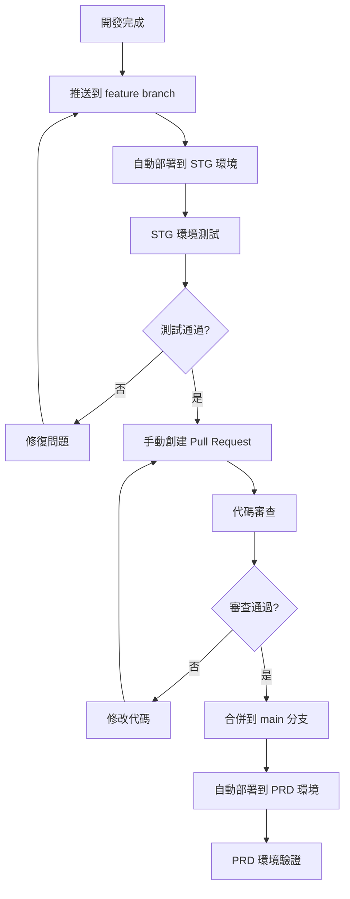

# CI/CD 工作流程規範

## 🔄 部署流程總覽

本專案採用 **STG → PRD 兩階段部署流程**，確保所有變更都經過充分測試和審核。



## 🚀 詳細流程步驟

### 1. STG 環境部署 (自動)

**觸發條件**：
- 推送到 `feature/**` 分支
- 推送到 `develop` 分支  
- 推送到 `hotfix/**` 分支

**自動執行**：
1. GitHub Actions 檢測到推送
2. 觸發 Cloud Build 建置
3. 部署到 STG 環境
4. 在 Actions 日誌中顯示部署完成通知

**STG 環境資訊**：
- 網址：https://japan-property-analyzer-864942598341.asia-northeast1.run.app
- 用途：功能測試、整合測試、用戶驗收測試
- 特性：設定 `noindex` 防止搜尋引擎索引

### 2. STG 環境測試 (手動)

**測試檢查清單**：
- [ ] 應用程式正常啟動
- [ ] 主要功能運作正常
- [ ] Google OAuth 登入功能正常
- [ ] 財務計算功能準確
- [ ] PDF 報告生成正常
- [ ] 響應式設計在不同裝置上正常
- [ ] 無明顯的 UI/UX 問題
- [ ] 無 JavaScript 錯誤
- [ ] 效能表現可接受

**測試完成後**：
✅ 如果測試通過 → 進入步驟 3
❌ 如果發現問題 → 修復後重新推送到 feature branch

### 3. 創建 Pull Request (手動)

**操作步驟**：
1. 前往 GitHub 專案頁面
2. 點擊 "Compare & pull request" 或 "New pull request"
3. 設定 PR 資訊：
   - **Base**: `main`
   - **Compare**: 您的 `feature/功能名稱` 分支
   - **標題**: 簡潔描述功能或修復
   - **描述**: 詳細說明變更內容

**PR 模板**：
```markdown
## 📋 變更摘要
簡要描述此 PR 的主要變更

## 🧪 STG 測試狀況
- [x] STG 環境部署成功
- [x] 功能測試通過
- [x] 整合測試通過
- [x] 用戶驗收測試通過

## 📸 截圖 (如適用)
貼上相關截圖

## 🔗 相關連結
- STG 測試網址: https://japan-property-analyzer-864942598341.asia-northeast1.run.app
- 相關 Issue: #123

## ✅ 檢查清單
- [x] 程式碼遵循專案規範
- [x] 已添加必要的測試
- [x] 文檔已更新
- [x] STG 環境測試通過
```

### 4. 代碼審查 (手動)

**審查重點**：
- 程式碼品質和可讀性
- 安全性考量
- 效能影響
- 與現有系統的相容性
- 測試覆蓋率

**審查者職責**：
- 仔細檢查程式碼變更
- 在 STG 環境進行功能驗證
- 提供建設性的反饋
- 確認符合專案標準

### 5. PRD 環境部署 (自動)

**觸發條件**：
- PR 合併到 `main` 分支

**自動執行**：
1. GitHub Actions 檢測到 main 分支更新
2. 觸發 Cloud Build 建置
3. 部署到 PRD 環境
4. 發送部署完成通知

**PRD 環境資訊**：
- 網址：https://japan-property-analyzer-prod-864942598341.asia-northeast1.run.app
- 用途：生產環境，面向真實用戶
- 特性：完整的監控和日誌記錄

### 6. PRD 環境驗證 (手動)

**驗證檢查清單**：
- [ ] 應用程式正常運行
- [ ] 主要功能可用
- [ ] 效能指標正常
- [ ] 監控系統正常
- [ ] 無錯誤日誌

## 🛡️ 安全規則

### 強制性規則
1. **🚫 禁止直接推送到 main 分支**
   - main 分支受到保護
   - 所有變更必須通過 Pull Request

2. **✅ 必須先通過 STG 測試**
   - 不可跳過 STG 環境測試
   - STG 測試失敗不得創建 PR

3. **👥 代碼審查必要**
   - 所有 PR 需要至少一位審查者批准
   - 審查者不能是 PR 創建者

4. **🧪 自動化檢查**
   - CI/CD 流程必須通過
   - 所有自動化測試必須通過

## 🚨 緊急修復流程

### Hotfix 流程
1. 從 `main` 分支創建 `hotfix/問題描述` 分支
2. 實施緊急修復
3. 推送到 `hotfix/**` 分支 (自動部署到 STG)
4. 快速 STG 測試
5. 創建緊急 PR 到 `main`
6. 快速審查和合併
7. 自動部署到 PRD

### 回滾流程
如果 PRD 部署後發現嚴重問題：
1. 立即創建 hotfix 分支修復
2. 或者回滾到上一個穩定版本：
   ```bash
   git revert <commit-hash>
   git push origin main
   ```

## 📊 監控和通知

### 部署狀態監控
- GitHub Actions 狀態
- Cloud Build 建置日誌
- Cloud Run 服務健康狀況

### 通知機制
- GitHub Actions 完成通知
- PR 狀態更新通知
- 部署成功/失敗通知

## 🔧 故障排除

### 常見問題

**STG 部署失敗**
1. 檢查 GitHub Actions 日誌
2. 檢查 Cloud Build 日誌
3. 確認 GCP 權限設定
4. 檢查 Dockerfile 和依賴

**PR 無法合併**
1. 確認所有檢查通過
2. 解決合併衝突
3. 確認有審查者批准
4. 檢查分支保護規則

**PRD 部署失敗**
1. 檢查 main 分支狀態
2. 檢查 Cloud Build 配置
3. 確認環境變數設定
4. 檢查 Cloud Run 服務配置

## 📝 最佳實踐

### 開發者指南
1. **小而頻繁的提交**：避免大型 PR
2. **清晰的提交訊息**：遵循 Conventional Commits
3. **充分的測試**：在 STG 環境進行全面測試
4. **及時的文檔更新**：保持文檔與程式碼同步

### 審查者指南
1. **及時審查**：在 24 小時內完成審查
2. **建設性反饋**：提供具體的改進建議
3. **安全性檢查**：特別關注安全相關變更
4. **效能考量**：評估對系統效能的影響

## 🎯 成功指標

- STG 部署成功率 > 95%
- PRD 部署成功率 > 99%
- 平均 PR 審查時間 < 24 小時
- 生產環境故障率 < 1%
- 回滾次數 < 每月 1 次

---

**記住**：這個流程的目的是確保程式碼品質和系統穩定性。每個步驟都很重要，不要為了速度而跳過任何環節。 