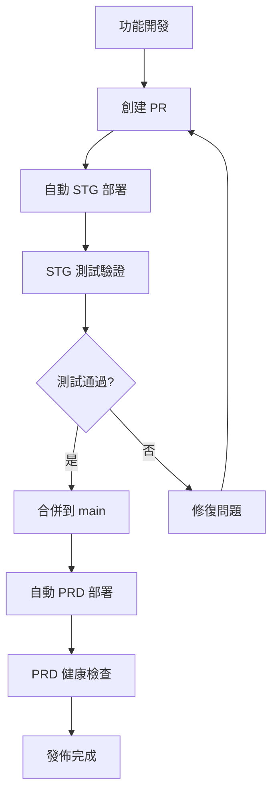

# 🚀 部署工作流程指南

## 📋 CI/CD 流程概述

### 🎯 **標準化發佈流程**

我們採用 **STG → PRD** 的雙環境部署策略，確保生產環境的穩定性：



## 🔄 **部署觸發機制**

| 事件 | 觸發條件 | 部署環境 | 說明 |
|------|----------|----------|------|
| **PR 創建/更新** | 對 `main` 分支的 PR | STG | 自動部署供測試 |
| **Push 到 main** | 合併 PR 後 | PRD | 自動部署到生產 |
| **手動觸發** | GitHub Actions | STG/PRD | 緊急部署或測試 |

## 📍 **詳細流程步驟**

### 🔧 **階段 1: 功能開發 → STG 部署**

1. **功能分支開發**
   ```bash
   git checkout -b feature/your-feature
   # 開發功能...
   git add .
   git commit -m "feat: 新增功能描述"
   git push origin feature/your-feature
   ```

2. **創建 Pull Request**
   - 目標分支: `main`
   - 自動觸發 STG 部署
   - CI/CD 檢查：程式碼品質、安全掃描

3. **STG 環境自動部署**
   - ✅ 程式碼品質檢查
   - ✅ 安全漏洞掃描
   - ✅ Docker 映像建置
   - ✅ 部署到 STG Cloud Run
   - ✅ 健康檢查驗證

### 🔍 **階段 2: STG 測試驗證**

**必須完成的測試項目：**

- [ ] **功能測試**: 新功能正常運作
- [ ] **回歸測試**: 現有功能未受影響
- [ ] **API 測試**: 所有端點正常回應
- [ ] **效能測試**: 回應時間符合預期
- [ ] **安全測試**: 無安全漏洞
- [ ] **使用者體驗**: UI/UX 符合設計

**STG 環境連結:**
- 應用程式: `https://japan-property-analyzer-{BUILD_ID}.run.app`
- 健康檢查: `/health`
- API 文件: `/docs` (如有)

### ✅ **階段 3: PRD 部署檢查點**

**部署前必要條件：**

1. ✅ **STG 測試完全通過**
2. ✅ **PR 審核批准**
3. ✅ **無高危安全問題**
4. ✅ **版本號已正確更新**

**合併 PR 觸發 PRD 部署：**
```bash
# 自動執行以下步驟：
# 1. 程式碼品質檢查
# 2. 建置 PRD Docker 映像
# 3. 部署到 PRD Cloud Run
# 4. 健康檢查驗證
# 5. 創建 GitHub Release
```

### 🎉 **階段 4: 發佈完成**

**部署後驗證：**
- [ ] **服務可用性**: PRD 環境正常回應
- [ ] **功能驗證**: 關鍵功能正常運作
- [ ] **監控檢查**: 無異常告警
- [ ] **效能指標**: CPU/記憶體使用正常

## 🛠️ **手動發佈工具**

### **版本管理**
```bash
# 查看版本狀態
python scripts/version_manager.py status

# 發佈新版本
python scripts/version_manager.py release patch "修復程式錯誤"
python scripts/version_manager.py release minor "新增功能"
python scripts/version_manager.py release major "重大更新"
```

### **發佈管理**
```bash
# 查看發佈狀態
python scripts/release_manager.py status

# 部署到 STG
python scripts/release_manager.py deploy-stg 1.1.0

# 完整發佈流程
python scripts/release_manager.py full-release 1.1.0
```

## 🚨 **緊急處理程序**

### **回滾操作**

1. **GitHub Actions 手動觸發**
   - 前往 Actions → CI/CD Pipeline
   - 選擇 "Run workflow"
   - 環境選擇 "rollback"

2. **命令列回滾**
   ```bash
   # 回滾到前一版本
   gcloud run services update-traffic japan-property-analyzer-prod \
     --region=asia-northeast1 \
     --to-revisions=PREVIOUS_REVISION=100
   ```

### **緊急修復流程**

1. **創建 Hotfix 分支**
   ```bash
   git checkout main
   git pull origin main
   git checkout -b hotfix/critical-fix
   ```

2. **快速修復 → STG 測試 → PRD 部署**
   - 遵循標準流程但加速審核
   - 可考慮跳過部分非關鍵測試

## 📊 **監控與告警**

### **部署監控指標**
- 部署成功率
- 部署時間
- 回滾頻率
- 健康檢查通過率

### **關鍵告警設定**
- PRD 服務不可用
- 錯誤率超過閾值
- 回應時間異常
- 記憶體/CPU 使用過高

## 🔐 **安全檢查清單**

### **部署前檢查**
- [ ] 依賴套件無高危漏洞
- [ ] 密鑰和設定檔未暴露
- [ ] API 端點具備適當驗證
- [ ] 輸入驗證機制完備

### **部署後驗證**
- [ ] HTTPS 憑證有效
- [ ] 安全標頭設定正確
- [ ] 錯誤訊息不洩露敏感資訊
- [ ] 日誌記錄符合合規要求

## 📈 **持續改善**

### **定期檢討項目**
- 部署流程效率
- 測試覆蓋率
- 錯誤發生率
- 團隊回饋意見

### **最佳實踐**
1. **小步快跑**: 頻繁小量部署
2. **自動化優先**: 減少人工操作
3. **監控驅動**: 數據支撐決策
4. **快速回滾**: 問題快速恢復

---

## 🆘 **支援聯絡**

如有部署問題，請聯絡：
- **技術支援**: [技術團隊聯絡方式]
- **緊急聯絡**: [24/7 支援聯絡方式]
- **文件問題**: [文件維護團隊] 