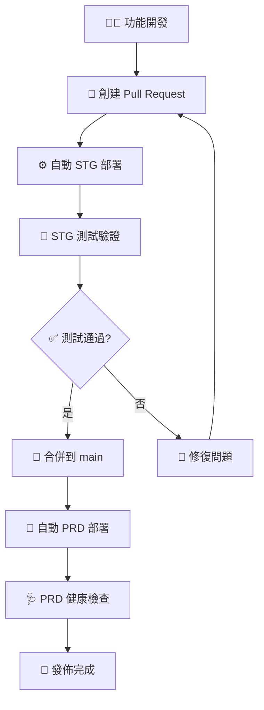

# 🚀 開發與部署工作流程指南 (Development & Deployment Workflow)

## 🎯 **流程核心原則**
我們採用 **STG (測試環境) → PRD (生產環境)** 的雙環境部署策略，並以自動化為核心，確保所有部署都經過驗證，保障生產環境的穩定性。



## 📍 **詳細流程步驟**

---
### **階段 1: 功能開發**

#### **1. 環境準備與建立分支**
在開始任何開發前，請先確保您的 `main` 分支是最新狀態。

```bash
# 1. 切換到 main 分支
git checkout main

# 2. 拉取遠端最新變更
git pull origin main

# 3. 根據功能或修復目的，建立新分支
# 命名規則: feature/功能, fix/問題, hotfix/緊急修復
git checkout -b feature/add-new-calculation
```

#### **2. 編碼與本地測試**
在此階段進行程式碼的撰寫與修改。

```bash
# 開發完成後，請務必在本地進行初步測試
python main.py
```

#### **3. 品質檢查與提交**
在提交程式碼前，執行品質檢查腳本以確保程式碼風格與品質符合標準。

```bash
# 執行品質檢查
python scripts/quality_checker.py

# 將變更加入暫存區
git add .

# 遵循規範撰寫提交訊息
git commit -m "feat: 新增風險分析功能"
```

---
### **階段 2: STG 部署與測試**

#### **1. 觸發 STG 部署**
將您的分支推送到遠端，並在 GitHub 上建立一個指向 `main` 分支的 Pull Request (PR)。

```bash
# 推送您的功能分支
git push origin feature/add-new-calculation
```
**此操作會自動觸發 CI/CD 流程，將您的變更部署到 STG 環境。**

#### **2. STG 環境測試驗證**
您必須在 STG 環境中手動驗證您的變更，確保新功能正常且未影響現有功能。

**STG 環境資訊:**
-   **應用程式 URL**: `https://japan-property-analyzer-stg-366005894157.asia-east1.run.app`
-   **健康檢查 URL**: `https://japan-property-analyzer-stg-366005894157.asia-east1.run.app/health`

**STG 測試檢查清單：**
- [ ] **功能測試**: 新功能正常運作
- [ ] **回歸測試**: 現有功能未受影響
- [ ] **API 測試**: 所有端點正常回應 (如有)
- [ ] **使用者體驗**: UI/UX 符合設計

**問題排查：**
如果 STG 測試失敗，您可以使用以下指令查看日誌：
```bash
# 檢查 STG 環境日誌
gcloud logging read "resource.type=cloud_run_revision AND resource.labels.service_name=japan-property-analyzer-stg" --limit=50
```

---
### **階段 3: PRD 部署 (合併至 `main`)**

#### **1. PRD 部署前檢查點**
在合併 PR 前，請務必確認：
- ✅ **STG 測試完全通過**
- ✅ **PR 已獲得至少一位同事的審核批准 (Code Review)**
- ✅ **版本號已根據 `VERSION_CONTROL_GUIDE.md` 的規範正確更新**
- ✅ **無高風險的安全問題**

#### **2. 觸發 PRD 部署**
在 GitHub 上點擊 **"Merge Pull Request"** 將您的分支合併到 `main`。

**此操作會自動觸發 CI/CD 流程，將最新的 `main` 分支程式碼部署到 PRD 環境。**

---
### **階段 4: 發佈完成與驗證**

部署完成後，請對生產環境進行快速驗證。

**PRD 環境資訊:**
-   **應用程式 URL**: `https://japan-property-analyzer-prod-864942598341.asia-northeast1.run.app`
-   **健康檢查 URL**: `https://japan-property-analyzer-prod-864942598341.asia-northeast1.run.app/health`

**部署後驗證：**
- [ ] **服務可用性**: PRD 環境可正常訪問
- [ ] **功能驗證**: 抽查一至兩項關鍵功能是否正常運作
- [ ] **監控檢查**: 確認 GCP Monitoring 無異常告警

## 🚨 **緊急處理程序**

### **回滾操作 (Rollback)**
如果生產環境發生嚴重問題，可以使用以下方式回滾至上一個穩定版本。

1.  **GitHub Actions 手動觸發**
    -   前往 Actions → `Production Deployment`
    -   選擇 "Run workflow" 並指定要回滾的版本標籤。
2.  **命令列回滾** (僅在自動化流程失效時使用)
    ```bash
    # 請將 PREVIOUS_REVISION 替換為要恢復的修訂版本號
    gcloud run services update-traffic japan-property-analyzer-prod \
      --region=asia-northeast1 \
      --to-revisions=PREVIOUS_REVISION=100
    ```

### **緊急修復流程 (Hotfix)**
緊急修復也必須遵循 **PR -> STG -> PRD** 的流程，但審核流程可以加速。
```bash
# 1. 從 main 建立 hotfix 分支
git checkout main
git pull origin main
git checkout -b hotfix/critical-security-patch

# 2. 快速修復、提交、推送
# ...
git push origin hotfix/critical-security-patch

# 3. 建立 PR，快速完成 STG 測試與合併
```

## ⚠️ **嚴格遵循流程 - 防範違規**

### 🚨 **絕對禁止的操作**
**❌ 禁止直接推送 (Push) 到 `main` 分支!** 這會繞過 STG 的測試和 PR 的程式碼審核，帶來極高風險。

```bash
# 🚨 以下操作是絕對禁止的！
git checkout main
git commit -m "some quick fix"
git push origin main
```
**分支保護規則已啟用，此操作將會被阻止。** 所有變更都必須透過 Pull Request 流程。

## ⚡ **快速命令參考**

### **日常開發**
```bash
# 開始新功能
git checkout main && git pull origin main && git checkout -b feature/new-feature

# 提交變更
git add . && git commit -m "feat: 功能描述"
git push origin feature/new-feature
```

### **問題排查**
```bash
# 檢查版本資訊
python -c "from version import get_version_info; print(get_version_info())"

# 檢查 PRD 服務健康狀態
curl https://japan-property-analyzer-prod-864942598341.asia-northeast1.run.app/health

# 查看最近的提交紀錄
git log --oneline -5
```

## 🛠️ **手動發佈工具**

### **版本管理**
```bash
# 查看版本狀態
python scripts/version_manager.py status

# 發佈新版本
python scripts/version_manager.py release patch "修復程式錯誤"
python scripts/version_manager.py release minor "新增功能"
python scripts/version_manager.py release major "重大更新"
```

### **備份管理**
```bash
# 創建代碼備份
python scripts/backup_manager.py backup

# 查看備份列表
python scripts/backup_manager.py list

# 清理舊備份
python scripts/backup_manager.py cleanup
```

## 📊 **監控與告警**

### **部署監控指標**
- 部署成功率
- 部署時間
- 回滾頻率
- 健康檢查通過率

### **關鍵告警設定**
- PRD 服務不可用
- 錯誤率超過閾值
- 回應時間異常
- 記憶體/CPU 使用過高

## 🔐 **安全檢查清單**

### **部署前檢查**
- [ ] 依賴套件無高危漏洞
- [ ] 密鑰和設定檔未暴露
- [ ] API 端點具備適當驗證
- [ ] 輸入驗證機制完備

### **部署後驗證**
- [ ] HTTPS 憑證有效
- [ ] 安全標頭設定正確
- [ ] 錯誤訊息不洩露敏感資訊
- [ ] 日誌記錄符合合規要求

## 📈 **持續改善**

### **定期檢討項目**
- 部署流程效率
- 測試覆蓋率
- 錯誤發生率
- 團隊回饋意見

### **最佳實踐**
1. **小步快跑**: 頻繁小量部署
2. **自動化優先**: 減少人工操作
3. **監控驅動**: 數據支撐決策
4. **快速回滾**: 問題快速恢復

---

## 🆘 **支援聯絡**

如有部署問題，請聯絡：
- **技術支援**: [技術團隊聯絡方式]
- **緊急聯絡**: [24/7 支援聯絡方式]
- **文件問題**: [文件維護團隊]

前往: https://github.com/BenjaminChangCH/japan-property-analyzer/pull/new/hotfix/dockerfile-syntax-fix
