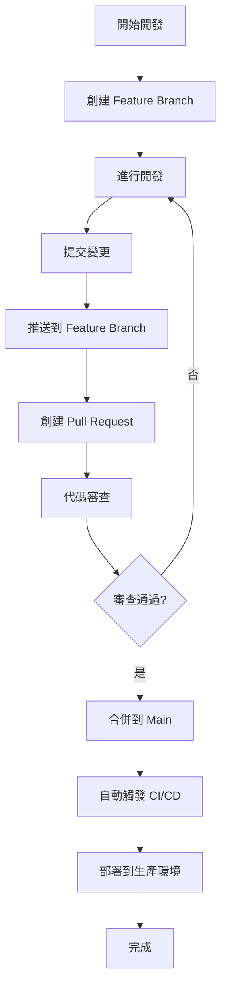

# Git Flow 開發流程指引

## 🔄 Git Flow 變化說明

### ⚠️ 重要變化：從直接推送到分支保護

#### **之前的流程（簡單直推）:**
```bash
git add .
git commit -m "更新功能"
git push origin main  # ✅ 直接成功
```

#### **現在的流程（受保護的 main 分支）:**
```bash
git add .
git commit -m "更新功能"
git push origin main  # ❌ 被拒絕！
# error: failed to push some refs
# hint: Updates were rejected because the remote contains work
```

## 🛡️ 為什麼需要這個變化？

### 安全性保護機制

1. **代碼審查**: 防止未經審查的代碼進入生產環境
2. **品質控制**: 確保所有變更都經過測試
3. **CI/CD 控制**: 只有審查過的代碼才會觸發自動部署
4. **團隊協作**: 標準化的開發流程

### GitHub 分支保護規則

您的 repository 已啟用以下保護：
- ✅ **Require pull request reviews**: 需要 PR 審查
- ✅ **Require status checks**: 需要通過狀態檢查
- ✅ **Require branches to be up to date**: 需要與 main 同步
- ✅ **Restrict pushes**: 限制直接推送到 main

## 📋 新的標準 Git Flow

### 🎯 完整開發流程



### 🔧 使用 Git Flow 助手工具

我們已經創建了 `scripts/git_flow_helper.py` 來簡化這個流程：

#### 1. 查看流程指引
```bash
python scripts/git_flow_helper.py
```

#### 2. 創建新的 Feature Branch
```bash
python scripts/git_flow_helper.py create "新功能名稱"
```
例如：
```bash
python scripts/git_flow_helper.py create "add-payment-feature"
python scripts/git_flow_helper.py create "fix-calculation-bug"
python scripts/git_flow_helper.py create "update-ga-tracking"
```

#### 3. 開發完成後提交
```bash
python scripts/git_flow_helper.py commit "feat: 新增付款功能"
```

#### 4. 工具會自動：
- ✅ 檢查當前分支（避免在 main 分支操作）
- ✅ 添加所有變更的檔案
- ✅ 提交變更
- ✅ 推送到遠端分支
- ✅ 顯示 Pull Request 創建連結

#### 5. 檢查 Git 狀態
```bash
python scripts/git_flow_helper.py status
```

## 🚀 實際操作範例

### 情境：新增一個計算功能

```bash
# 1. 創建 feature branch
python scripts/git_flow_helper.py create "add-tax-calculation"
# 🌿 創建新分支: feature/add-tax-calculation
# 📥 拉取最新變更...
# ✅ 成功創建並切換到分支: feature/add-tax-calculation

# 2. 進行開發（編輯檔案）
# ... 修改 main.py, 新增測試檔案等 ...

# 3. 提交變更
python scripts/git_flow_helper.py commit "feat: 新增稅務計算功能"
# 📁 檔案變更:
# M  main.py
# A  tests/test_tax_calculation.py
# 📤 添加變更...
# 💾 提交變更...
# 🚀 推送到遠端...
# ✅ 成功推送到 feature/add-tax-calculation
# 
# 🔗 創建 Pull Request:
#    https://github.com/your-repo/pull/new/feature/add-tax-calculation

# 4. 點擊連結創建 PR
# 5. 在 GitHub 上審查並合併
# 6. 合併後會自動觸發部署
```

## ⚡ 快速命令參考

```bash
# 基本流程
python scripts/git_flow_helper.py create "功能名稱"
# ... 進行開發 ...
python scripts/git_flow_helper.py commit "提交訊息"

# 檢查狀態
python scripts/git_flow_helper.py status

# 查看幫助
python scripts/git_flow_helper.py
```

## 🔄 Pull Request 流程

### 在 GitHub 上操作

1. **創建 PR**: 點擊工具提供的連結
2. **填寫描述**: 
   - 標題：簡潔描述變更
   - 內容：詳細說明變更內容
   - 標籤：選擇適當的標籤
3. **審查變更**: 檢查 Files changed 分頁
4. **合併 PR**: 點擊 "Merge pull request"
5. **刪除分支**: 合併後可選擇刪除 feature branch

### PR 標題建議格式

```
feat: 新增功能描述
fix: 修復問題描述  
docs: 更新文檔
test: 新增測試
refactor: 重構代碼
style: 格式調整
chore: 雜項更新
```

## 🛠️ 故障排除

### 常見問題與解決方案

#### 1. 推送被拒絕
```bash
# 錯誤訊息
error: failed to push some refs to 'origin'
hint: Updates were rejected because the remote contains work

# 解決方案：使用 feature branch
python scripts/git_flow_helper.py create "your-feature-name"
```

#### 2. 分支落後於 main
```bash
# 在 feature branch 中同步最新變更
git checkout main
git pull origin main
git checkout feature/your-feature-name
git merge main
```

#### 3. 忘記在哪個分支
```bash
python scripts/git_flow_helper.py status
# 🌿 當前分支: feature/your-feature-name
```

## 🎯 最佳實踐

### 1. 分支命名規範
```
feature/功能描述     # 新功能
fix/問題描述        # 修復
hotfix/緊急修復     # 緊急修復
docs/文檔更新       # 文檔
test/測試相關       # 測試
```

### 2. 提交訊息格式
```
類型: 簡短描述

詳細說明（可選）

相關 Issue: #123
```

### 3. PR 最佳實踐
- 保持 PR 小而聚焦
- 提供清晰的描述
- 包含測試覆蓋
- 及時回應審查意見

## 📞 獲得幫助

如果遇到 Git Flow 相關問題：

1. **查看工具幫助**: `python scripts/git_flow_helper.py`
2. **檢查當前狀態**: `python scripts/git_flow_helper.py status`
3. **參考文檔**: 查看 `docs/PROJECT_STRUCTURE.md`

---

**🎉 恭喜！您現在已經掌握了新的 Git Flow 開發流程！**

這個流程雖然多了幾個步驟，但能確保代碼品質和部署安全性。
使用我們提供的工具，整個流程會變得非常簡單和自動化。 