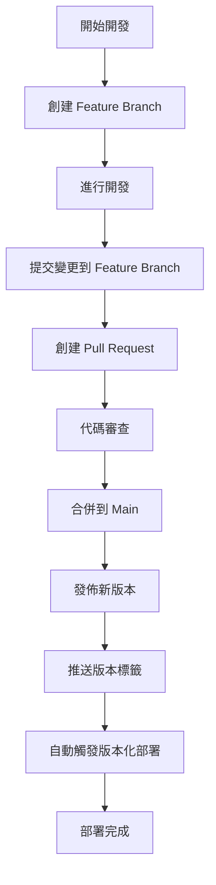

# 版本號控制指引

## 📊 版本號控制概覽

您的專案現在已經建立了完整的**版本號控制系統**！

### 🎯 當前版本狀態
- **版本號管理**: ✅ 已建立
- **Git 標籤**: ✅ 自動化
- **CI/CD 整合**: ✅ 完成
- **發佈流程**: ✅ 標準化

## 📋 版本號系統架構

### 🔢 Semantic Versioning (SemVer)

我們採用 **Semantic Versioning** 標準：

```
MAJOR.MINOR.PATCH.BUILD
  ↓     ↓     ↓     ↓
  1  .  0  .  0  . 12abc34
```

**版本類型說明：**
- **MAJOR**: 重大功能變更或不相容的 API 變更
- **MINOR**: 新增功能，向後相容
- **PATCH**: 錯誤修復，向後相容
- **BUILD**: CI/CD 自動產生的建置編號

### 📁 核心檔案

```
Project Japan/
├── 📄 version.py               # 版本號定義檔案
├── 📁 scripts/
│   └── 📄 version_manager.py   # 版本號管理工具
└── 📁 deployment/
    ├── 📄 Dockerfile          # 支援版本號建置
    ├── 📄 cloudbuild-production.yaml  # PRD 版本化部署
    └── 📄 cloudbuild-staging.yaml     # STG 版本化部署
```

## 🔧 使用方式

### 1. 查看當前版本狀態

```bash
python scripts/version_manager.py status
```

輸出示例：
```
📊 版本號狀態
==================================================
當前版本: 1.0.0
當前分支: main
最新標籤: 無標籤
工作目錄: 乾淨
```

### 2. 發佈新版本

#### 📦 Patch 版本 (錯誤修復)
```bash
python scripts/version_manager.py release patch "修復計算錯誤"
```

#### 🚀 Minor 版本 (新功能)
```bash
python scripts/version_manager.py release minor "新增稅務計算功能"
```

#### 💥 Major 版本 (重大更新)
```bash
python scripts/version_manager.py release major "重構計算引擎"
```

### 3. 完整發佈流程示例

```bash
# 1. 查看當前狀態
python scripts/version_manager.py status

# 2. 發佈新版本
python scripts/version_manager.py release minor "新增付款功能"
# 🚀 開始發佈新版本 (minor)
# ==================================================
# 版本更新: 1.0.0 → 1.1.0
# ✅ 更新 version.py: 1.1.0
# ✅ 提交版本更新: 1.1.0
# ✅ 創建 Git 標籤: v1.1.0
# ✅ 版本 1.1.0 準備完成
# 🔄 使用以下命令推送到遠端:
#    git push origin main
#    git push origin v1.1.0

# 3. 推送到遠端 (會觸發自動部署)
git push origin main
git push origin v1.1.0
```

## 🚀 CI/CD 版本化部署

### 自動化流程

當您推送版本標籤時，CI/CD 會自動：

1. **讀取版本號**: 從 `version.py` 獲取版本
2. **生成建置編號**: 使用 Cloud Build ID
3. **建置 Docker 映像**: 標記為 `版本號.建置編號`
4. **部署到環境**: 設定版本環境變數
5. **標記映像**: 同時保留 `latest` 和版本標籤

### 環境變數設定

部署後，應用程式會有以下環境變數：
```bash
APP_VERSION=1.1.0          # 版本號
BUILD_NUMBER=12abc34       # 建置編號
ENVIRONMENT=production     # 環境標識
```

### 版本資訊 API

您可以通過 API 端點查看版本資訊：
```bash
curl https://your-domain.com/version
```

回應：
```json
{
  "version": "1.1.0.12abc34",
  "version_info": [1, 1, 0],
  "app_name": "Japan Property Analyzer",
  "description": "日本不動產投資與商業模式財務分析",
  "author": "Benjamin Chang",
  "release_date": "2024-12-19",
  "build_number": "12abc34"
}
```

## 🔄 與 Git Flow 的整合

### 新的開發流程



### 整合工作流程

```bash
# 1. 正常的 Git Flow 開發
git checkout -b feature/add-payment-feature
# ... 進行開發 ...
git add . && git commit -m "feat: 新增付款功能" && git push origin feature/add-payment-feature
# ... 創建並合併 PR ...

# 2. 合併到 main 後，發佈版本
git checkout main
git pull origin main
python scripts/version_manager.py release minor "新增付款功能"

# 3. 推送版本 (觸發部署)
git push origin main
git push origin v1.1.0
```

## 📊 版本號策略建議

### 何時使用各種版本類型

#### 🔧 PATCH (修復)
- 修復計算錯誤
- 修復 UI 問題
- 效能優化
- 安全性修復

```bash
python scripts/version_manager.py release patch "修復利率計算精確度"
```

#### 🚀 MINOR (功能)
- 新增計算模式
- 新增 API 端點
- 改進使用者介面
- 新增測試功能

```bash
python scripts/version_manager.py release minor "新增商業租賃計算模式"
```

#### 💥 MAJOR (重大變更)
- 重構核心演算法
- 不相容的 API 變更
- 重大架構變更
- 技術棧升級

```bash
python scripts/version_manager.py release major "重構為微服務架構"
```

## 🛠️ 故障排除

### 常見問題

#### 1. 版本發佈失敗
```bash
# 檢查 Git 狀態
python scripts/version_manager.py status

# 確保在 main 分支且沒有未提交變更
git checkout main
git pull origin main
git status
```

#### 2. 標籤推送失敗
```bash
# 手動推送特定標籤
python scripts/version_manager.py push 1.1.0
```

#### 3. 版本資訊不正確
```bash
# 查看版本檔案
python version.py

# 查看 API 版本資訊
python -c "from version import get_version_info; print(get_version_info())"
```

## 📈 版本號發展範例

```
v1.0.0 - 初始發佈 (基本計算功能)
├── v1.0.1 - 修復計算精確度
├── v1.0.2 - 修復 UI 響應問題
├── v1.1.0 - 新增 Airbnb 模式
├── v1.1.1 - 修復 GA 追蹤
├── v1.2.0 - 新增法人購買模式
├── v1.2.1 - 優化計算效能
└── v2.0.0 - 重構為多語系支援
```

## 🎯 最佳實踐

### 1. 版本發佈時機
- **每個 Sprint/週期結束**時發佈 Minor 版本
- **緊急修復**時發佈 Patch 版本
- **重大里程碑**時發佈 Major 版本

### 2. 版本訊息撰寫
```bash
# 好的版本訊息
python scripts/version_manager.py release minor "新增多幣別支援功能"

# 避免的版本訊息
python scripts/version_manager.py release minor "更新"
```

### 3. 發佈前檢查清單
- [ ] 所有測試通過
- [ ] 功能完整測試
- [ ] 文檔已更新
- [ ] 沒有未提交的變更
- [ ] 在 main 分支上

---

**🎉 恭喜！您現在擁有完整的企業級版本號控制系統！**

這個系統讓您的專案具備：
- 🔢 **標準化版本管理**
- 🚀 **自動化部署**
- 📊 **版本追溯能力**
- 🛡️ **品質控制流程** 